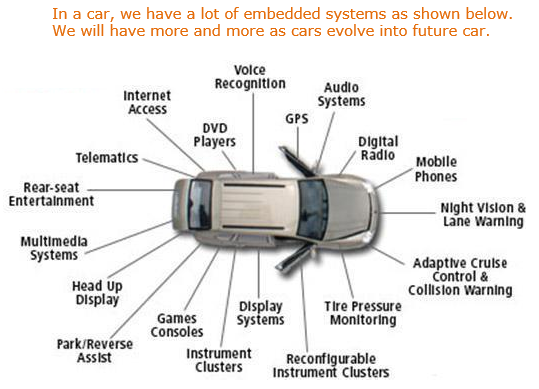
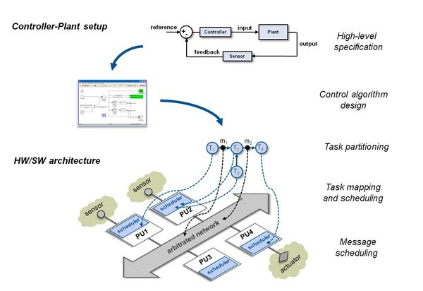

# Embedded-System

Embedded System is combination of Hardware and Software. These Systems are designed to do particular task and with necessary peripherals required to run it.  embedded systems are time sensitive applications which are not possible in general purpose systems. These devices including mobiles, Cars(brake System), Avionics(REU), Digital Clock, Remote Controllers, Robot.

## Embedded-system-architecture

# 

In Embedded Systems hardware is designed for the perticular purpose and sameas the software. The Hardware will be designed in orcad tool. Processor is the key element of perticular Systems. We need to select the Processor Based on Requirements. Software should be written for perticular processor. Software will be changed based the processor. As per System requirements Hardware and Software will be added like if any other interfaces are done to the systems. Below are the different types of processors are used in the embedded systems.

- Microprocessor
- Microcontroller(Atmel, Pic, Motorola etc.)
- DSP (C6000)
- DSC (TMS320F28335 etc.)
- FPGA (Xilinx etc.)
- CPLD 
- SOP
Above all have some advantages and Disadvantages. We need to select based on requirements

## Characteristics of Embedded System
 
 Well Designed Systems also fail in Some cases. Following characteristics should be considered to develop a system error free.
 
 1. Should be Dependable
    - Safety
    - Security
    - Reliability
    - maintainability
    - Availability
    - Efficient
  2. Efficient
     - Energy
     - Cost
     - Run time
     - code size
   3. Dedicated
   4. Real Time Constraint
   
   ## Embedded System Design usage in Different Fields
   
   1. Health Care
     
     
   2. Automative
     
     
   3. Cyber Technolgy   
    
   
   
   Reference Links
   
   [Real time examples of Embedded System](https://www.theengineeringprojects.com/2016/11/examples-of-embedded-systems.html)
   [Embedded System Overview](https://www.tutorialspoint.com/embedded_systems/es_overview.htm)
   [Types of Embedded Systems](http://www.itrelease.com/2018/07/examples-and-types-of-embedded-systems/)
   [Embedded System Software](https://www.coursera.org/learn/introduction-embedded-systems)
   
      
     
 
 
